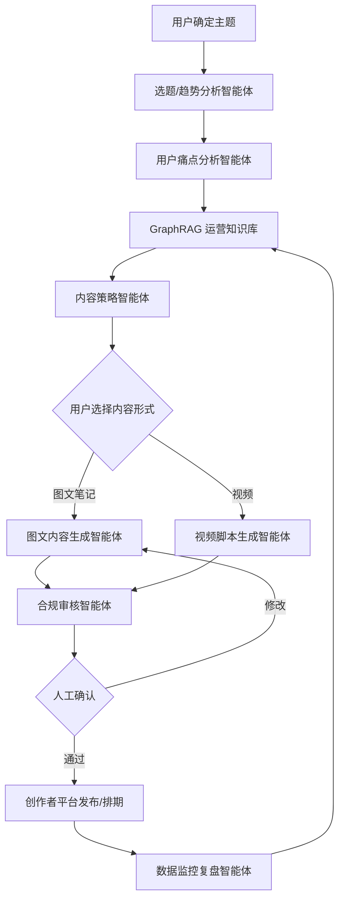
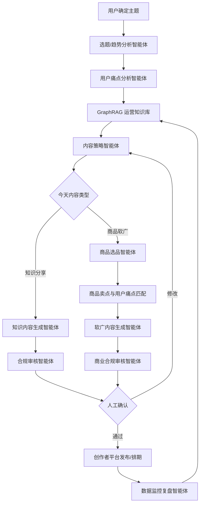

# 小红书知识分享与商品软广两阶段多智能体系统方案

## 1. 项目背景

本方案基于前期讨论形成，目标是为一个刚起步的小红书账号设计一套可落地的多智能体自动化内容运营系统。

账号当前处于冷启动阶段，因此第一阶段不建议直接做商品软广或带货内容，而应先通过知识分享型内容建立账号标签、积累用户信任、测试用户痛点，并通过数据复盘不断训练系统的运营记忆。

后续当账号积累一定内容基础和用户信任之后，再逐步引入商品软广、分销商品、达人合作和商业化投放。

---

## 2. 项目定位

本项目不是简单的“小红书自动发帖工具”，而是一个围绕小红书内容运营的多智能体增长系统。

更准确的定位是：

> 面向小红书新账号的知识分享型内容冷启动与商业化辅助系统。

完整描述可以写成：

> 本系统面向刚起步的小红书账号，第一阶段以知识分享内容为主，通过用户主题输入、平台内容分析、评论痛点提取、GraphRAG 运营记忆和内容生成智能体，辅助账号完成图文或视频内容生产、发布和复盘；第二阶段在账号积累一定信任和内容标签后，引入商品选品智能体和软广生成智能体，实现知识分享与商品种草的平衡运营。

---

## 3. 总体运营思想

系统的核心不是“自动发帖”，而是：

```text
自动洞察用户痛点，并把每一次发布结果沉淀为下一次内容生产的运营记忆。
```

完整闭环为：

```text
用户确定主题
↓
平台内容 / 达人 / 商品数据辅助分析
↓
用户痛点提取
↓
GraphRAG 调用历史运营经验
↓
内容生成：图文笔记 / 视频脚本
↓
合规审核
↓
人工确认
↓
发布 / 排期
↓
数据监控与复盘
↓
回写 GraphRAG
↓
进入下一轮内容生产
```

---

## 4. 两阶段运营策略

系统应按照账号发展阶段分为两个阶段。

---

# 阶段一：冷启动阶段，只做知识分享

## 4.1 阶段目标

账号刚刚起步时，核心目标不是变现，而是：

```text
建立账号垂直标签
积累基础内容
测试用户真实痛点
训练 GraphRAG 运营记忆
找到高收藏、高评论、高关注的内容方向
建立用户信任
```

## 4.2 阶段周期建议

建议冷启动阶段至少持续：

```text
3-4 周
```

或者达到：

```text
累计发布 30-50 篇内容
```

再考虑进入第二阶段。

## 4.3 阶段一允许的内容类型

阶段一只允许生成知识分享相关内容，包括：

```text
知识分享型内容
经验总结型内容
避坑清单型内容
问答科普型内容
步骤教程型内容
```

暂时不建议生成：

```text
商品软广
强种草
测评带货
合作邀请
分销内容
```

## 4.4 阶段一推荐内容比例

冷启动阶段前 30 篇内容可以全部是知识分享，但内部应区分不同内容结构。

推荐比例为：

```text
干货科普型：40%
避坑清单型：25%
经验共鸣型：20%
问答互动型：15%
```

示例：

| 内容类型 | 目的 | 示例 |
|---|---|---|
| 干货科普型 | 建立专业感 | 宝宝湿疹和过敏怎么区分 |
| 避坑清单型 | 提高收藏率 | 湿疹护理这 5 个坑别踩 |
| 经验共鸣型 | 提高评论率 | 我以前也以为湿疹只能靠药膏 |
| 问答互动型 | 获取用户痛点 | 宝宝湿疹反复，妈妈最容易忽略什么 |

## 4.5 阶段一重点指标

冷启动阶段不重点看成交，而是看：

```text
收藏率
评论率
关注转化率
视频完播率
用户提问数量
高频痛点关键词
账号内容标签稳定性
```

---

# 阶段二：知识分享 + 商品软广

## 4.6 进入第二阶段的判断条件

不要按固定时间直接进入商品软广阶段，而应根据数据判断。

建议满足以下条件后再进入第二阶段：

```text
累计发布 ≥ 30 篇内容
至少有 3 个稳定高表现主题
收藏率明显高于账号平均水平
评论区开始出现“求推荐”“怎么买”“用什么”之类问题
账号内容标签比较稳定
用户对账号有一定信任感
```

特别是当评论区出现以下信号时，可以考虑引入软广：

```text
“这个用什么比较好？”
“有推荐的吗？”
“在哪里买？”
“求链接”
“有没有平替？”
“你家用的是哪款？”
```

这些信号说明用户已经从“看知识”进入“想解决问题”的阶段。

## 4.7 阶段二内容比例

进入第二阶段后，也不要突然变成广告号。

推荐比例：

```text
知识分享：70%
商品软广：30%
```

如果账号还比较弱，可以更保守：

```text
知识分享：80%
商品软广：20%
```

示例发布节奏：

```text
周一：知识分享
周二：避坑清单
周三：知识分享
周四：经验共鸣
周五：软广种草
```

或者：

```text
每 4 篇知识分享后，插入 1 篇软广
```

原则：

```text
不要连续发软广
软广必须基于用户真实痛点
软广必须人工审核
软广内容不能破坏账号信任
```

---

## 5. 平台能力结合方案

前期讨论中提到三个平台能力：

```text
创作者平台
蒲公英平台
千帆平台
```

这三个平台可以分别对应系统中的不同能力。

---

## 5.1 创作者平台

已知能力包括：

```text
二维码登录 / 手机验证码登录
上传图集作品
上传视频作品
查看已发布作品列表
```

适合接入：

```text
分发智能体
账号发布智能体
数据监控智能体
```

核心作用：

```text
自己发内容
查看自己已发布内容
记录发布状态
回收发布结果
```

对应业务闭环：

```text
内容生成
↓
合规审核
↓
人工确认
↓
创作者平台上传图文 / 视频
↓
查看已发布作品列表
↓
记录作品表现
↓
复盘并回写 GraphRAG
```

---

## 5.2 蒲公英平台

已知能力包括：

```text
获取 KOL 博主列表 & 详细数据
获取博主粉丝画像 & 历史趋势
发起合作邀请
```

适合接入：

```text
达人投放智能体
选题趋势分析智能体
KOL 匹配智能体
合作 Brief 生成智能体
```

核心作用：

```text
找达人
看达人数据
看达人粉丝画像
判断达人是否适合某个主题或产品
生成合作 brief
发起合作邀请
记录合作结果
```

阶段一可以暂时不使用发起合作邀请，只把它作为选题和趋势分析辅助。

阶段二或后期商业化阶段，可以用于达人合作投放。

---

## 5.3 千帆平台

已知能力包括：

```text
获取分销商列表 & 详细数据
获取分销商合作品类 / 店铺 / 商品信息
```

适合接入：

```text
商品选品智能体
商品卖点分析智能体
软广内容生成智能体
商业化复盘智能体
```

核心作用：

```text
找商品
看店铺
看分销商
提取商品卖点
匹配用户痛点
辅助生成软广内容
记录商品转化表现
```

阶段一不建议接入千帆作为主流程。

阶段二再引入千帆，用于知识分享后的自然种草和分销内容。

---

## 6. 三个平台之间的组合关系

可以用一句话概括：

```text
创作者平台解决“怎么发”
蒲公英平台解决“找谁发、参考谁”
千帆平台解决“卖什么、推什么”
```

## 6.1 创作者平台 + 内容生成

适合第一阶段。

```text
用户确定主题
↓
生成图文笔记 / 视频脚本
↓
合规审核
↓
人工确认
↓
创作者平台发布
↓
查看作品列表
↓
复盘内容表现
```

## 6.2 蒲公英平台 + 创作者平台

适合内容增长阶段。

```text
蒲公英看达人趋势
↓
分析什么主题容易火
↓
内容生成智能体生成自己的笔记
↓
创作者平台发布
↓
监控表现
```

作用：

```text
不用只靠自己猜选题
可以参考达人市场数据
用达人趋势反哺自己账号内容
```

## 6.3 千帆平台 + 创作者平台

适合自营账号软广 / 分销。

```text
千帆获取商品信息
↓
商品选品智能体分析卖点
↓
内容生成智能体生成软广笔记
↓
创作者平台发布
↓
监控数据
```

## 6.4 蒲公英平台 + 千帆平台

适合品牌方或商家做达人投放。

```text
千帆找到商品 / 店铺 / 品类
↓
蒲公英找到匹配达人
↓
系统生成达人合作 brief
↓
发起合作邀请
↓
记录合作结果
```

## 6.5 三平台完整商业闭环

适合后期规模化。

```text
千帆选商品
↓
蒲公英选达人
↓
创作者平台自营内容铺垫
↓
达人合作同步投放
↓
监控自营内容和达人内容表现
↓
GraphRAG 记录什么商品、什么痛点、什么达人类型效果最好
```

---

## 7. 总体智能体架构

建议系统设计为以下智能体：

```text
1. 用户主题智能体
2. 数据源选择智能体
3. 选题 / 趋势分析智能体
4. 数据清洗智能体
5. 用户痛点分析智能体
6. 内容策略智能体
7. GraphRAG 运营知识库智能体
8. 内容生成智能体
9. 合规审核智能体
10. 账号发布智能体
11. 数据监控复盘智能体
12. 商品选品智能体
13. 达人投放智能体
```

其中阶段一重点实现：

```text
用户主题智能体
选题 / 趋势分析智能体
用户痛点分析智能体
内容策略智能体
GraphRAG 运营知识库智能体
内容生成智能体
合规审核智能体
账号发布智能体
数据监控复盘智能体
```

阶段二再加入：

```text
商品选品智能体
软广内容生成能力
达人投放智能体
商业化复盘能力
```

---

## 8. 阶段一系统流程

阶段一只做知识分享。



## 8.1 阶段一流程文字版

```text
用户确定主题
↓
系统分析主题下的高关注内容和用户痛点
↓
GraphRAG 调用历史知识
↓
用户选择当天内容形式
    ├── 图文笔记
    └── 视频脚本
↓
内容生成智能体生成知识分享内容
↓
合规审核智能体审核
↓
人工确认
↓
创作者平台发布 / 排期
↓
数据复盘
↓
回写 GraphRAG
```

---

## 9. 阶段二系统流程

阶段二做知识分享 + 商品软广。



## 9.1 阶段二流程文字版

```text
用户确定主题
↓
系统判断内容策略
    ├── 继续知识分享
    └── 可以插入软广
↓
如果知识分享：
    生成知识内容
↓
如果软广：
    千帆获取商品信息
    ↓
    商品选品智能体分析卖点
    ↓
    匹配用户痛点
    ↓
    生成软广笔记 / 视频
↓
合规审核
↓
人工确认
↓
创作者平台发布
↓
数据监控
↓
回写 GraphRAG
```

---

## 10. 内容策略智能体设计

内容策略智能体负责判断：

```text
今天适合发知识分享，还是软广？
适合图文，还是视频？
适合科普，还是避坑？
适合做旧主题延展，还是测试新主题？
```

判断依据包括：

```text
账号阶段
最近 7 天内容表现
GraphRAG 中历史高表现主题
用户当天选择
评论区用户痛点
是否有合适商品
是否已经连续发过软广
```

## 10.1 阶段一策略规则

```json
{
  "account_stage": "cold_start",
  "allow_soft_ad": false,
  "allowed_content_types": [
    "knowledge_share",
    "experience_summary",
    "avoid_mistakes",
    "qa_education"
  ],
  "allowed_formats": [
    "image_text",
    "video"
  ],
  "manual_review_required": true
}
```

## 10.2 阶段二策略规则

```json
{
  "account_stage": "growth_and_monetization",
  "allow_soft_ad": true,
  "knowledge_share_ratio": 0.7,
  "soft_ad_ratio": 0.3,
  "max_soft_ads_per_week": 2,
  "no_consecutive_soft_ads": true,
  "soft_ad_manual_review_required": true,
  "allowed_formats": [
    "image_text",
    "video"
  ]
}
```

---

## 11. 图文笔记生成规范

当用户选择图文笔记时，系统输出：

```text
标题 5 个
封面文案 3 个
正文
图片页结构
每页图片文案
图片生成提示词
话题标签
评论区引导语
合规提醒
```

示例：

```text
主题：宝宝湿疹护理
形式：图文笔记
类型：知识分享
```

输出结构：

```text
标题：
宝宝湿疹反复不好？先别急着换药膏

封面文案：
湿疹护理 4 个误区

正文结构：
第 1 页：为什么宝宝湿疹容易反复
第 2 页：湿疹和普通干燥怎么区分
第 3 页：日常护理重点
第 4 页：容易踩的坑
第 5 页：什么时候需要看医生

评论引导：
你家宝宝湿疹一般出现在脸上、脖子还是腿上？
```

---

## 12. 视频内容生成规范

当用户选择视频时，系统输出：

```text
视频标题
开头 3 秒钩子
30-60 秒口播脚本
分镜脚本
字幕文案
画面建议
封面文案
话题标签
评论区引导
合规提醒
```

示例：

```text
视频标题：
宝宝湿疹反复？新手妈妈先看这 3 点

开头钩子：
宝宝湿疹一直反复，真的不一定是你护理错了，但这几个坑一定要避开。

视频结构：
0-3 秒：提出痛点
3-15 秒：解释常见原因
15-35 秒：给出护理建议
35-50 秒：提醒就医边界
50-60 秒：评论区互动
```

---

## 13. 商品软广生成规范

第二阶段才启用商品软广。

商品软广必须遵循以下原则：

```text
先讲用户痛点
再讲解决思路
再自然引出商品
不要一上来直接推产品
不要夸大效果
不要承诺确定结果
不要连续发布软广
软广必须人工审核
```

软广内容输出：

```text
标题 5 个
封面文案 3 个
正文
商品卖点拆解
用户痛点匹配说明
图片 / 视频脚本建议
话题标签
评论区引导
商业合规提醒
```

示例结构：

```text
痛点：
宝宝湿疹反复，妈妈不知道保湿霜怎么选

内容角度：
先讲湿疹护理中的保湿原则，再讲保湿霜选择标准，最后自然引出某类温和保湿产品。

正文结构：
1. 宝宝湿疹反复时，很多妈妈第一反应是换药膏
2. 但日常护理里，保湿和减少刺激也很重要
3. 选保湿产品时可以重点看这几个方面
4. 某类产品适合日常护理场景
5. 不同宝宝情况不同，严重时建议咨询医生
```

---

## 14. GraphRAG 运营知识库设计

GraphRAG 是系统的长期运营记忆，不只是保存文案，而是保存关系。

---

## 14.1 阶段一 GraphRAG 节点

冷启动阶段重点记录：

```text
主题
子主题
用户痛点
标题结构
图文结构
视频结构
评论问题
内容表现
合规风险
```

阶段一可以称为：

```text
内容运营知识库
```

---

## 14.2 阶段二 GraphRAG 节点

进入商品软广阶段后，增加：

```text
商品
品类
卖点
用户痛点与商品匹配关系
软广内容表现
转化数据
用户对商品的评论反馈
达人
粉丝画像
合作记录
投放表现
```

阶段二可以升级为：

```text
内容 + 商品商业化知识库
```

---

## 14.3 GraphRAG 关系设计

```text
主题 → 包含 → 子主题
子主题 → 触发 → 用户痛点
用户痛点 → 适合 → 内容形式
内容形式 → 产生 → 高收藏
标题结构 → 提升 → 点击率
评论观点 → 反映 → 用户疑虑
笔记表现 → 证明 → 选题有效
违规风险 → 限制 → 表达方式
用户痛点 → 匹配 → 商品卖点
商品 → 属于 → 品类
商品 → 来自 → 店铺
店铺 → 关联 → 分销商
主题 → 适合 → 达人类型
达人 → 拥有 → 粉丝画像
达人 → 擅长 → 内容形式
达人 → 历史表现 → 互动数据
内容 → 发布于 → 创作者平台
合作 → 发起于 → 蒲公英平台
商品 → 来源于 → 千帆平台
```

---

## 15. 数据表设计

## 15.1 笔记数据表

| 字段名 | 含义 |
|---|---|
| note_id | 笔记 ID |
| keyword | 关键词 |
| title | 标题 |
| content | 正文 |
| author_type | 作者类型 |
| publish_time | 发布时间 |
| like_count | 点赞数 |
| collect_count | 收藏数 |
| comment_count | 评论数 |
| share_count | 分享数 |
| tags | 标签 |
| content_type | 内容类型 |
| cover_style | 封面风格 |
| url | 原始链接 |
| source | 数据来源 |
| created_at | 数据记录时间 |

---

## 15.2 评论数据表

| 字段名 | 含义 |
|---|---|
| comment_id | 评论 ID |
| note_id | 所属笔记 ID |
| comment_text | 评论文本 |
| comment_type | 评论类型 |
| sentiment | 情绪倾向 |
| pain_point | 对应痛点 |
| question_intent | 是否提问 |
| purchase_intent | 是否有购买意图 |
| created_at | 数据记录时间 |

评论数据建议去标识化，不要保存用户主页、头像、昵称、账号 ID 等不必要信息。

---

## 15.3 发布数据表

| 字段名 | 含义 |
|---|---|
| post_id | 已发布笔记 ID |
| platform | 发布平台 |
| post_type | 图文 / 视频 |
| title | 标题 |
| topic | 主题 |
| publish_time | 发布时间 |
| publish_status | 发布状态 |
| creator_account | 创作者账号 |
| review_status | 审核状态 |

---

## 15.4 复盘数据表

| 字段名 | 含义 |
|---|---|
| post_id | 已发布笔记 ID |
| topic | 主题 |
| title | 标题 |
| content_type | 内容类型 |
| publish_time | 发布时间 |
| exposure | 曝光量 |
| click_rate | 点击率 |
| like_rate | 点赞率 |
| collect_rate | 收藏率 |
| comment_rate | 评论率 |
| follow_rate | 关注转化率 |
| conversion | 转化数据 |
| best_comment_keywords | 高频评论关键词 |
| negative_feedback | 负面反馈 |
| next_action | 下一步动作 |

---

## 15.5 商品数据表

| 字段名 | 含义 |
|---|---|
| product_id | 商品 ID |
| product_name | 商品名称 |
| category | 商品品类 |
| shop_name | 店铺名称 |
| distributor | 分销商 |
| selling_points | 商品卖点 |
| target_pain_points | 匹配痛点 |
| content_angle | 适合内容角度 |
| risk_note | 合规风险提示 |

---

## 15.6 达人数据表

| 字段名 | 含义 |
|---|---|
| kol_id | 达人 ID |
| kol_name | 达人名称 |
| category | 达人领域 |
| follower_profile | 粉丝画像 |
| historical_trend | 历史趋势 |
| average_interaction | 平均互动 |
| suitable_topic | 适合主题 |
| cooperation_status | 合作状态 |
| brief | 合作 brief |

---

## 16. 系统目录结构建议

```text
xiaohongshu-agent/
│
├── agents/
│   ├── topic_agent.py              # 用户主题分析
│   ├── source_agent.py             # 数据源选择
│   ├── collector_agent.py          # 内容采集
│   ├── cleaner_agent.py            # 数据清洗
│   ├── insight_agent.py            # 用户痛点分析
│   ├── strategy_agent.py           # 内容策略判断
│   ├── content_agent.py            # 内容生成
│   ├── video_agent.py              # 视频脚本生成
│   ├── compliance_agent.py         # 合规审核
│   ├── creator_agent.py            # 创作者平台发布
│   ├── product_agent.py            # 千帆商品/分销分析
│   ├── kol_agent.py                # 蒲公英达人分析与合作
│   ├── review_agent.py             # 数据复盘
│   └── graphrag_agent.py           # GraphRAG 运营记忆
│
├── platforms/
│   ├── creator_platform.py         # 创作者平台接口
│   ├── pugongying_platform.py      # 蒲公英平台接口
│   └── qianfan_platform.py         # 千帆平台接口
│
├── prompts/
│   ├── topic_analysis_prompt.md
│   ├── pain_point_prompt.md
│   ├── content_strategy_prompt.md
│   ├── image_text_generation_prompt.md
│   ├── video_script_prompt.md
│   ├── soft_ad_prompt.md
│   ├── compliance_check_prompt.md
│   └── review_prompt.md
│
├── data/
│   ├── notes.csv
│   ├── comments.csv
│   ├── products.csv
│   ├── shops.csv
│   ├── distributors.csv
│   ├── kol_profiles.csv
│   ├── publish_logs.csv
│   └── performance_logs.csv
│
├── memory/
│   ├── graph_db/
│   ├── vector_db/
│   └── operation_history.json
│
├── output/
│   ├── image_text_notes/
│   ├── video_scripts/
│   ├── image_prompts/
│   ├── publish_plan/
│   ├── kol_briefs/
│   ├── product_analysis/
│   └── review_reports/
│
└── config/
    ├── account_stage.json
    ├── publish_rules.json
    ├── content_ratio.json
    └── compliance_rules.json
```

---

## 17. 核心 Prompt 模板

## 17.1 内容策略判断 Prompt

```text
你是一个小红书内容策略智能体。

当前账号阶段：
{{account_stage}}

最近 7 天内容表现：
{{recent_performance}}

GraphRAG 中历史高表现主题：
{{historical_success_topics}}

用户今天输入的主题：
{{topic}}

用户可选择的内容形式：
{{allowed_formats}}

请判断今天适合生成什么内容：

1. 是否适合继续做知识分享；
2. 是否适合测试新主题；
3. 是否适合做图文笔记还是视频；
4. 如果账号处于冷启动阶段，禁止生成商品软广；
5. 如果账号处于商业化阶段，判断是否可以插入软广；
6. 输出推荐理由和内容生成要求。

请用 JSON 输出。
```

---

## 17.2 图文笔记生成 Prompt

```text
你是一个资深小红书图文笔记创作者。

用户主题：
{{topic}}

目标人群：
{{target_user}}

用户痛点：
{{pain_points}}

内容类型：
{{content_type}}

历史表现较好的内容结构：
{{successful_patterns}}

请生成一篇小红书图文笔记，要求：

1. 给出 5 个标题；
2. 给出 3 个封面文案；
3. 给出正文；
4. 给出图片页结构；
5. 给出每页图片文案；
6. 给出图片生成提示词；
7. 给出 5-10 个标签；
8. 给出评论区引导语；
9. 如果涉及健康、母婴、教育、金融等敏感领域，必须加入风险提示；
10. 输出 Markdown 格式。
```

---

## 17.3 视频脚本生成 Prompt

```text
你是一个小红书短视频脚本策划专家。

用户主题：
{{topic}}

目标人群：
{{target_user}}

用户痛点：
{{pain_points}}

视频时长：
{{video_duration}}

内容类型：
{{content_type}}

请生成一个小红书短视频脚本，要求：

1. 给出视频标题；
2. 给出开头 3 秒钩子；
3. 给出 30-60 秒口播脚本；
4. 给出分镜脚本；
5. 给出字幕文案；
6. 给出画面建议；
7. 给出封面文案；
8. 给出话题标签；
9. 给出评论区引导；
10. 给出合规提醒。
```

---

## 17.4 商品软广生成 Prompt

```text
你是一个小红书软广内容策划专家。

用户主题：
{{topic}}

产品或服务：
{{product}}

目标人群：
{{target_user}}

用户痛点：
{{pain_points}}

商品卖点：
{{selling_points}}

请生成一篇软广种草型小红书笔记，要求：

1. 不要一上来直接推产品；
2. 先从真实痛点切入；
3. 中间给出实用建议；
4. 最后自然引出产品或服务；
5. 不使用绝对化、夸大化表达；
6. 不承诺确定效果；
7. 如果属于商业推广，需要提醒用户进行广告或合作标识；
8. 输出标题、封面文案、正文、标签、评论引导和合规提醒。
```

---

## 17.5 合规审核 Prompt

```text
你是一个内容合规审核智能体。

请审核以下小红书笔记内容：

{{content}}

请从以下维度进行检查：

1. 是否存在虚假宣传；
2. 是否存在绝对化表达；
3. 是否涉及医疗诊断或治疗承诺；
4. 是否存在夸大产品效果；
5. 是否存在平台不鼓励的引流表达；
6. 是否疑似搬运或高度模仿；
7. 是否涉及未成年人隐私；
8. 是否需要商业推广标识；
9. 是否存在版权风险；
10. 是否建议发布。

请输出：
- 风险等级：低 / 中 / 高
- 主要风险点
- 修改建议
- 修改后的安全版本
```

---

## 18. 技术落地路线

## 18.1 第一阶段：知识分享 MVP

目标：

```text
跑通“主题 → 痛点 → 内容 → 发布 → 复盘”的最小闭环。
```

功能：

```text
用户输入主题
用户选择图文 / 视频
生成知识分享内容
生成图片提示词或视频脚本
合规审核
人工确认
发布或排期
记录发布数据
复盘并回写 GraphRAG
```

推荐技术：

```text
WorkBuddy / Dify / Coze / LangGraph
CSV / Excel / SQLite
JSON + 向量库
Markdown 输出
人工审核发布
```

---

## 18.2 第二阶段：创作者平台接入

目标：

```text
支持图文 / 视频作品上传和作品列表获取。
```

功能：

```text
二维码登录 / 手机验证码登录
上传图集作品
上传视频作品
查看已发布作品列表
记录发布状态
```

注意：

```text
保留人工确认
避免批量自动发布
避免高频操作
```

---

## 18.3 第三阶段：GraphRAG 运营记忆增强

目标：

```text
让系统记住哪些主题、痛点、标题和内容形式效果好。
```

功能：

```text
主题入库
痛点入库
标题结构入库
内容表现入库
评论关键词入库
下次生成时调用历史经验
```

---

## 18.4 第四阶段：商品软广能力

目标：

```text
在账号建立基础信任后，引入商品种草。
```

功能：

```text
千帆获取商品 / 店铺 / 分销商信息
商品选品智能体提取卖点
用户痛点与商品卖点匹配
生成软广图文 / 视频
商业合规审核
人工确认发布
复盘软广表现
```

---

## 18.5 第五阶段：蒲公英达人投放能力

目标：

```text
后期用于达人合作和投放放大。
```

功能：

```text
获取 KOL 列表
获取达人详情
获取粉丝画像
分析历史趋势
筛选合作达人
生成合作 brief
发起合作邀请
记录合作结果
```

---

## 19. 风险与注意事项

## 19.1 平台规则风险

需要避免：

```text
高频抓取
模拟登录绕过限制
批量采集用户信息
批量自动发布
搬运或高度仿写爆款内容
诱导站外引流
未标识商业推广
```

## 19.2 内容合规风险

尤其母婴、健康、教育、金融类内容，要避免：

```text
绝对化表达
疗效承诺
制造焦虑
虚构经历
虚假测评
夸大产品效果
冒充专业人士
```

## 19.3 数据隐私风险

建议：

```text
只保留必要字段
评论去标识化
不存储用户主页、头像、昵称、账号 ID
不做人群画像和个人追踪
只做主题级别和内容级别分析
```

---

## 20. 最推荐的落地顺序

当前最适合的落地顺序是：

```text
第 1 步：只做知识分享内容生成
第 2 步：支持图文和视频两种形式
第 3 步：接入创作者平台做发布和作品列表获取
第 4 步：记录每篇内容数据
第 5 步：让复盘智能体判断哪些主题值得继续
第 6 步：GraphRAG 沉淀主题、痛点、标题和表现
第 7 步：账号稳定后再接入千帆商品信息
第 8 步：开始低频软广测试
第 9 步：后期再接入蒲公英达人合作能力
```

---

## 21. 最终方案总结

本系统建议采用两阶段路径：

```text
阶段一：
知识分享冷启动
目标是养账号、打标签、积累内容、测试痛点、建立信任。

阶段二：
知识分享 + 商品软广
目标是在不破坏账号信任的基础上，自然承接用户需求，逐步实现商业化。
```

三个平台的作用分别是：

```text
创作者平台：负责自营内容发布和作品管理
蒲公英平台：负责达人数据、粉丝画像和合作邀请
千帆平台：负责商品、店铺、分销商和商业化选品
```

最终闭环是：

```text
用户主题
↓
用户痛点
↓
内容策略
↓
图文 / 视频内容生成
↓
合规审核
↓
人工确认
↓
发布
↓
数据复盘
↓
GraphRAG 记忆
↓
下一轮内容优化
```

一句话总结：

```text
先用知识分享养账号和训练系统，再用用户真实痛点自然承接商品软广。
```
